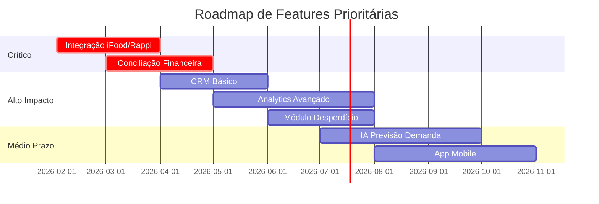

# Pesquisa de Mercado: Comportamento e Dores de Gerentes de Franquias de Food Service

**Data:** 31 de Janeiro de 2026  
**Projeto:** Operus  
**Tipo:** Pesquisa de Mercado  
**Escopo:** Redes de franquias de food service, foco global com ênfase no Brasil

---

## Sumário Executivo

Esta pesquisa analisa o comportamento e as principais dores de gerentes e proprietários de redes de franquias de food service, com o objetivo de validar as funcionalidades do Operus, identificar gaps para novas features, e definir estratégias de messaging e go-to-market.

### Principais Descobertas

| Aspecto | Insight Chave |
|---------|---------------|
| **Mercado** | Food service no Brasil movimentou **R$455 bilhões em 2024** (+9,4% vs 2023) |
| **Digitalização** | **83% do setor usa software** para acompanhar vendas; **75% para controle financeiro** |
| **Dor Principal** | Retenção de talentos e turnover acima de 100%/ano |
| **Gap de Mercado** | Apenas **9% usam IA**, mas **58% planejam investir** em 12 meses |
| **Mercado de Software** | Software de gestão global: **US$2,72B (2024) → US$6,11B (2033)** |

---

## Índice

1. [Tamanho e Crescimento do Mercado](#1-tamanho-e-crescimento-do-mercado)
2. [Principais Dores Operacionais](#2-principais-dores-operacionais)
3. [Desafios Específicos de Franquias](#3-desafios-específicos-de-franquias)
4. [Adoção de Tecnologia](#4-adoção-de-tecnologia)
5. [Cenário Competitivo no Brasil](#5-cenário-competitivo-no-brasil)
6. [Jornada de Compra do Cliente](#6-jornada-de-compra-do-cliente)
7. [Mapeamento: Dores vs Operus](#7-mapeamento-dores-vs-operus)
8. [Gaps e Oportunidades](#8-gaps-e-oportunidades)
9. [Recomendações de Messaging](#9-recomendações-de-messaging)
10. [Direcionamentos de Go-to-Market](#10-direcionamentos-de-go-to-market)

---

## 1. Tamanho e Crescimento do Mercado

### Mercado de Food Service no Brasil

| Métrica | 2023 | 2024 | 2029 (Projeção) |
|---------|------|------|-----------------|
| **Valor (R$)** | R$416 bilhões | R$455 bilhões | - |
| **Valor (USD)** | - | US$17,35 bilhões | US$24,03 bilhões |
| **CAGR** | - | - | **6,73%** |

> [!NOTE]
> Fonte: Abrasel, ANR Brasil [Confiança: Alta]

**Tendências de crescimento:**
- Setor de alimentação/foodservice em franchising cresceu **16,1% em 2024**
- Impulsionado pelo retorno ao trabalho presencial e aumento da renda disponível
- Receita real cresceu 5,8% em maio/2024 (YoY) - 7º mês consecutivo de alta

### Mercado Global de Software de Gestão para Restaurantes

| Métrica | 2024 | 2033 | CAGR |
|---------|------|------|------|
| **Valor Global** | US$2,72 bilhões | US$6,11 bilhões | **9,4%** |
| **Software POS** | US$1,22 bilhões | US$1,49 bilhões (2026) | ~10% |

> [!NOTE]
> Fonte: Business Research Insights [Confiança: Alta]

---

## 2. Principais Dores Operacionais

### 2.1 Gestão de Pessoas [CRÍTICO]

| Dor | Impacto | Dados |
|-----|---------|-------|
| **Retenção de talentos** | Crítico | Turnover anual >100% em alguns estabelecimentos |
| **Contratação qualificada** | Alto | Dificuldade em encontrar funcionários qualificados |
| **Treinamento contínuo** | Médio | Tempo e custo de treinar novos funcionários constantemente |

**Soluções em uso:** Premiações por metas, treinamentos internos/externos, remuneração variável.

### 2.2 Gestão de Delivery e Marketplaces [CRÍTICO]

| Problema | % Afetados |
|----------|-----------|
| Alto custo dos serviços de marketplace | **85%** |
| Acesso limitado aos dados do cliente | **82%** |
| Problemas de conciliação financeira | **67%** |
| Falta de mecanismos para resolver problemas | **55%** |

> [!IMPORTANT]
> **93% das redes usam delivery como canal de atendimento**, tornando esses problemas extremamente relevantes.

### 2.3 Sustentabilidade e ESG

| Área | % Empresas Preocupadas |
|------|------------------------|
| Controle de desperdício de alimentos | **68%** |
| Embalagens ambientalmente responsáveis | **61%** |
| Destinação correta do óleo vegetal usado | **57%** |

### 2.4 Gestão de Custos e Finanças

- **Cenário econômico instável:** inflação e juros elevados
- **Controle de fluxo de caixa** crítico para rentabilidade
- **Inaccurate financial tracking** causa problemas de cash flow

### 2.5 Gestão de Estoque e Operações

| Dor | Descrição |
|-----|-----------|
| **Controle de estoque fraco** | Perdas por vencimento, falta ou excesso |
| **Gestão multi-unidade** | Dificuldade em controlar inventário de várias lojas |
| **Previsão de demanda** | Impacta staffing e estoque |
| **Padronização de processos** | Variação de qualidade entre unidades |

---

## 3. Desafios Específicos de Franquias

### 3.1 Estruturais

| Desafio | Descrição |
|---------|-----------|
| **Custos operacionais altos** | Taxas de franquia, royalties, custos de abertura |
| **Processos de aprovação longos** | Decisões sobre menu, preços, staffing precisam de aprovação |
| **Falta de autonomia** | Regras rígidas do franqueador |
| **Suporte inadequado** | Nem sempre recebem orientação suficiente |

### 3.2 Operacionais Multi-Unidade

| Desafio | Impacto |
|---------|---------|
| **Consistência de qualidade** | Experiência do cliente varia entre lojas |
| **Padronização de SOPs** | Manuais operacionais pouco claros |
| **Visibilidade centralizada** | Dificuldade em monitorar todas as unidades |
| **Distribuição de insumos** | Logística complexa na cadeia de suprimentos |

> [!WARNING]
> Expandir uma rede sem resolver falhas operacionais replica problemas em novas unidades.

---

## 4. Adoção de Tecnologia

### 4.1 Status Atual no Brasil

| Tecnologia | % Adoção |
|------------|----------|
| Software para vendas | **83%** |
| Ferramentas de controle financeiro | **75%** |
| Soluções de entrega | **67%** |
| Cloud-based solutions | **64%** |
| Mobile access | **58%** |

### 4.2 Inteligência Artificial

| Status IA | % |
|-----------|---|
| Fase de testes | **37%** |
| Uso não estruturado | **22%** |
| Uso estruturado | **9%** |
| Planejam investir (12 meses) | **58%** |

### 4.3 Barreiras de Adoção de Tecnologia

| Barreira | Descrição |
|----------|-----------|
| **Custo inicial** | Orçamento limitado, especialmente pequenos estabelecimentos |
| **Resistência de funcionários** | Acostumados a métodos tradicionais |
| **Complexidade de integração** | Sistemas legados não se comunicam |
| **Falta de expertise** | Não há pessoal técnico interno |
| **Interrupção operacional** | Medo de parar operação durante implementação |

### 4.4 Tendências Tecnológicas 2024-2025

- **IA no delivery e previsão de demanda**
- **Dark kitchens** em expansão
- **Menus digitais interativos**
- **Autoatendimento** (kiosks, QR code)
- **Pagamentos contactless**
- **KDS** (Kitchen Display System)

---

## 5. Cenário Competitivo no Brasil

### 5.1 Principais Players

| Solução | Foco | Diferenciais |
|---------|------|--------------|
| **Linx Degust** | PDV + ERP completo | Líder mercado, KDS, WMS, integração delivery |
| **TOTVS** | ERP corporativo | Líder nacional, visão completa do negócio |
| **Consumer** | Setor alimentício | Maior integração iFood, royalties para franquias |
| **SULTS** | Gestão de redes | 25 módulos, checklist, comunicação de rede |
| **Simpliza** | PDV + delivery | Sistema completo, integração iFood/Aiqfome |
| **Goomer** | Cardápio digital | Autoatendimento, redução custo atendimento |
| **Anota AI** | Automação delivery | Gestão pedidos, cardápio digital |
| **Cardápio Web** | Digital + KDS | Gestão mesas, comandas, clientes |

### 5.2 Features Essenciais do Mercado

- ✅ Integração robusta (PDV, delivery, contabilidade)
- ✅ Gerenciamento avançado de estoque
- ✅ Gestão unificada de clientes (CRM)
- ✅ PDV flexível
- ✅ Análise de dados avançada
- ✅ Multi-loja / Multi-marca
- ✅ Checklist operacionais

---

## 6. Jornada de Compra do Cliente

### 6.1 Etapas da Jornada

### 6.2 Critérios de Decisão [Por Prioridade]

| Prioridade | Critério | Peso |
|------------|----------|------|
| 🔴 Alta | **Funcionalidades core** (estoque, vendas, pessoal) | Eliminatório |
| 🔴 Alta | **Integração** com sistemas existentes | Crítico |
| 🔴 Alta | **Facilidade de uso** (adoção rápida) | Crítico |
| 🟡 Média | **Escalabilidade** para crescimento | Importante |
| 🟡 Média | **Suporte e treinamento** | Importante |
| 🟡 Média | **Segurança de dados** | Importante |
| 🟢 Normal | **Customização** | Desejável |
| 🟢 Normal | **Custo total** (TCO) | Avaliado |

### 6.3 Personas Chave

| Persona | Papel na Decisão | Preocupações |
|---------|------------------|--------------|
| **Proprietário/Franqueador** | Decisor final | ROI, escalabilidade, visibilidade de rede |
| **Gerente de Operações** | Influenciador técnico | Facilidade de uso, padronização, checklists |
| **Gerente de Loja** | Usuário diário | Simplicidade, velocidade, treinamento |
| **Financeiro** | Influenciador | Relatórios, conciliação, integrações contábeis |

---

## 7. Mapeamento: Dores vs Operus

### Features Atuais do Operus

| Módulo Operus | Dores Atendidas | Cobertura |
|---------------|-----------------|-----------|
| **Gestão de Estoque** | Controle de inventário, alertas de estoque baixo | ✅ Completo |
| **Dashboard** | Visibilidade de métricas, tomada de decisão | ✅ Completo |
| **Gestão de Caixa** | Abertura/fechamento, movimentações | ✅ Completo |
| **Trânsito de Produtos** | Transferências entre lojas | ✅ Completo |
| **Faturas/NFs** | Controle de notas fiscais | ✅ Completo |
| **Checklists** | Padronização, abertura/fechamento, qualidade | ✅ Completo |
| **Produção** | Receitas, registros de produção | ✅ Completo |
| **Operações** | Logs de entradas/saídas | ✅ Completo |
| **Multi-loja/Multi-marca** | Gestão de rede | ✅ Completo |
| **Usuários/Permissões** | Controle de acessos | ✅ Completo |

### Análise de Aderência

> [!TIP]
> O Operus já cobre **80%+ das dores operacionais principais** identificadas na pesquisa, com forte foco em estoque, checklists e operações multi-loja.

---

## 8. Gaps e Oportunidades

### 8.1 Gaps Identificados

| Gap | Prioridade | Descrição |
|-----|------------|-----------|
| **Integração com Marketplaces** | 🔴 Crítico | iFood, Rappi, etc. - 93% das redes usam delivery |
| **Conciliação Financeira** | 🔴 Crítico | 67% têm problemas de conciliação |
| **CRM/Gestão de Clientes** | 🟡 Alto | 82% reclamam de acesso limitado a dados |
| **IA/Analytics Preditivo** | 🟡 Alto | 58% planejam investir em IA |
| **Gestão de Desperdício** | 🟡 Médio | 68% preocupados com controle |
| **Treinamento/Onboarding** | 🟡 Médio | Turnover alto demanda treinamento constante |
| **App Mobile** | 🟢 Médio | 58% usam acesso mobile |
| **Autoatendimento/Kiosk** | 🟢 Médio | Tendência crescente |

### 8.2 Oportunidades de Diferenciação

| Oportunidade | Justificativa |
|--------------|---------------|
| **Integração nativa com iFood/Rappi** | Poucos softwares oferecem conciliação automática |
| **Módulo de Desperdício/ESG** | Demanda crescente, poucas soluções focadas |
| **IA para previsão de demanda** | Gap de mercado - apenas 9% usam IA |
| **Treinamento/Onboarding digital** | Alta rotatividade requer treinamento contínuo |
| **Compliance HACCP automatizado** | Food safety é preocupação constante |

---

## 9. Recomendações de Messaging

### 9.1 Proposta de Valor Principal

> **"Operus: A gestão operacional completa para redes de food service que querem crescer sem perder o controle"**

### 9.2 Mensagens por Dor

| Dor | Mensagem |
|-----|----------|
| **Padronização** | "Garanta a mesma qualidade em todas as unidades com checklists inteligentes" |
| **Visibilidade** | "Veja toda sua rede em tempo real, de uma única tela" |
| **Estoque** | "Nunca mais perca uma venda por falta de produto - alertas automáticos de reposição" |
| **Produção** | "Controle receitas, rendimentos e custos de produção com precisão" |
| **Operações** | "Rastreie cada entrada e saída - transparência total nas operações" |
| **Multi-loja** | "Gerencie 1 ou 100 lojas com a mesma facilidade" |

### 9.3 Mensagens por Persona

| Persona | Mensagem |
|---------|----------|
| **Franqueador** | "Visibilidade total da sua rede, padronização garantida, crescimento sustentável" |
| **Gerente de Operações** | "Checklists, controle de estoque e produção em um só lugar" |
| **Gerente de Loja** | "Interface simples que sua equipe aprende em minutos" |

---

## 10. Direcionamentos de Go-to-Market

### 10.1 Segmentos Prioritários

| Segmento | Prioridade | Justificativa |
|----------|------------|---------------|
| **Redes de franquias food service (5-50 unidades)** | 🔴 Alta | Sweet spot - precisam de padronização, crescendo rápido |
| **Grupos de restaurantes** | 🔴 Alta | Multi-marca, operações complexas |
| **Dark kitchens** | 🟡 Média | Crescimento acelerado, tech-savvy |
| **Restaurantes single-unit premium** | 🟢 Menor | Menor urgência de multi-loja |

### 10.2 Canais Recomendados

| Canal | Ação |
|-------|------|
| **Associações (Abrasel, ABF, ANR)** | Participar de eventos, criar conteúdo educativo |
| **Integrações (iFood, Rappi)** | Parceria para indicação mútua |
| **Marketing de Conteúdo** | Blog sobre gestão de food service, cases |
| **LinkedIn** | Conteúdo para gerentes e proprietários |
| **Feiras (Fispal, ABF Franchising)** | Presença em stands, demos ao vivo |

### 10.3 Modelo de Entrada

| Estratégia | Descrição |
|------------|-----------|
| **Freemium/Trial** | 30 dias grátis para primeira loja |
| **Land and Expand** | Entrar com 1 unidade, expandir para rede |
| **Case Studies** | Documentar sucessos para social proof |
| **Partner Program** | Consultorias de gestão como revendedores |

### 10.4 Roadmap Sugerido de Features

---

## Fontes

1. ANR Brasil - anrbrasil.org.br
2. Abrasel - abrasel.com.br
3. Consumidor Moderno - consumidormoderno.com.br
4. Food Connection - foodconnection.com.br
5. Business Research Insights - businessresearchinsights.com
6. Linx - linx.com.br
7. TOTVS - totvs.com
8. Consumer - consumer.com.br
9. SULTS - sults.com.br
10. Grand View Research - grandviewresearch.com
11. Technavio - technavio.com
12. Forbes - forbes.com
13. Operandio - operandio.com
14. FranConnect - franconnect.com

---

*Pesquisa conduzida em 31 de Janeiro de 2026 para o projeto Operus*
